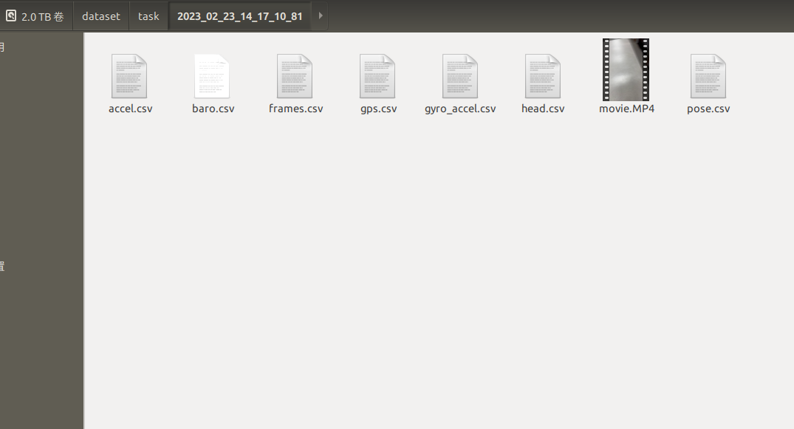

# ios-data-collector

该仓库参考：https://github.com/OSUPCVLab/marslogger_ios/tree/56bfe7e78a5f7ea5ad10f97c4fe0d7bd032b0ede。
## 编译运行:
1. Open MarsLogger.xcodeproj in XCode
2. In project properties -> General set your team signing and make sure that signing certificate was successfully created
3. Connect your device (you may have to wait for the debugger to be set up), select it (Product -> Destination) and run application (Product -> Run)
## 增加的功能
原ios数据采集软件采集相机和IMU的数据，因为项目需要我们在此基础上添加了磁力计、ARKit Pose、气压计和GPS信息

## Dataset format:
* accel.csv: time(s(from 1970)),ax(g-units),ay(g-units),az(g-units)
* baro.csv: time(s(from 1970)),baro(Kpa)
* head.csv: Timestamp,trueHeading,magneticHeading,headingAccuracy
* gyro_accel.csv: Timestamp[nanosec], gx[rad/s], gy[rad/s], gz[rad/s], ax[m/s^2], ay[m/s^2], az[m/s^2]
* gps.csv: Timestamp,currLatitude,currLongitude
* pose.csv:Timestamp,tx,ty,tz,qx,qy,qz,qw
* frames.csv: time(s),frameNumber,_focalLenghtX,focalLenghtY,principalPointX,principalPointY_
* movie.MP4: frames compressed in video 

